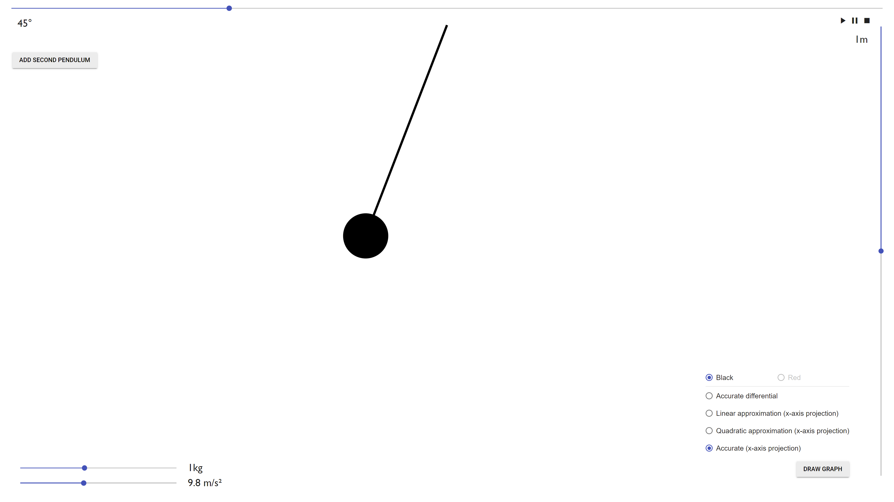

<div align="center">
  

  <h1 align="center">Pendulum simulation</h1>

  <p align="center">
    A pendulum simulation web app
  </p>
  <br>
</div>


## About The Project



The goal of this project was to create an accurate pendulum simulation. I do this by using different equations to calculate the position of the pendulum. \
\
I started this project at high school with my physics teacher, who also provided me the equations for the pendulum.


### Built With

* HTML
* CSS
* Javascript


## Getting Started

### Prerequisites

Just a web browser

### Installation

Clone the repo
   ```sh
   git clone https://github.com/michaltrejdl/pendulum-sim.git
   ```
   
### Running

Open `index.html` in a web browser, no server needed
